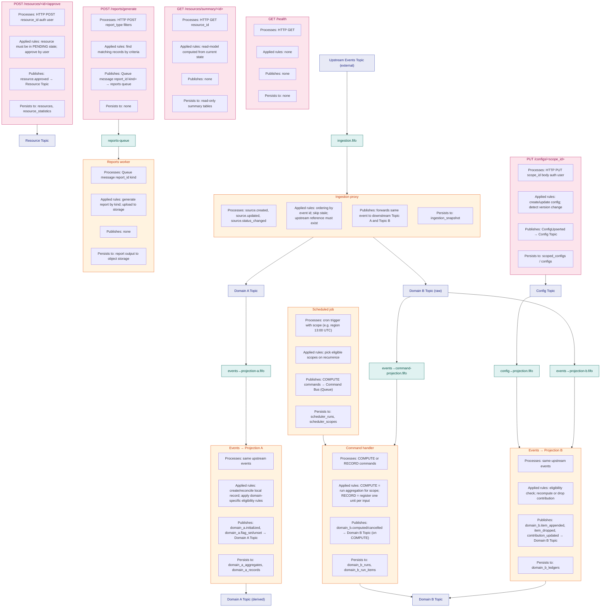

# [Service Name] event-driven architecture

This is a **cloud-agnostic template** for documenting the event-driven flow between compute handlers (functions/lambdas), pub/sub topics, and queues in a service. It uses simulated, generic components and routes — no real implementation details — so an agent or engineer can use it as a reference for producing an equivalent document on **any** cloud provider (AWS, GCP, Azure, or a self-hosted broker).

For each handler and each API route, document: **what it processes**, **what business rules it applies**, **what it publishes**, and **where it persists data**.

**Last documented:** `<commit-hash>` — `<short commit message describing the doc update>`

When updating, scan modifications since that commit first: `git log <hash>..HEAD --oneline` or `git diff <hash>..HEAD -- src/` (replace `<hash>` with the commit above). After editing, update the hash with `git rev-parse HEAD` and a short message.

---

## Vocabulary map (pick your provider, use consistent terms)

This template uses three generic roles. Map them to whatever your actual stack uses, and stay consistent throughout the document:

| Generic term       | AWS               | GCP                          | Azure                              | Self-hosted           |
| ------------------- | ----------------- | ----------------------------- | ------------------------------------ | ---------------------- |
| **Function/Handler** | Lambda             | Cloud Function / Cloud Run     | Azure Function / Container App       | Any worker process      |
| **Topic** (pub/sub, fan-out) | SNS Topic    | Pub/Sub Topic                  | Event Grid Topic / Service Bus Topic | Kafka topic / RabbitMQ exchange |
| **Queue** (point-to-point) | SQS Queue     | Pub/Sub Subscription (pull)    | Service Bus Queue / Storage Queue    | Kafka consumer group / RabbitMQ queue |
| **Command bus**      | SQS FIFO queue     | Pub/Sub ordered topic          | Service Bus session-enabled queue    | Ordered queue with partition key |
| **Object storage**    | S3                 | Cloud Storage                  | Blob Storage                          | MinIO / any object store |
| **Batch job**         | AWS Batch          | Cloud Run Jobs / Batch          | Azure Batch / Container Apps Jobs    | Any async job runner    |
| **Scheduler/cron**    | EventBridge Scheduler | Cloud Scheduler             | Logic Apps / Azure Scheduler         | cron / Temporal        |

Do not mix vendor-specific names inside the diagram itself — use the generic term (Function, Topic, Queue) in labels, and only note the real provider mapping once, in a legend or in this table.

---

## Diagram

The example below is fully simulated (generic "Orders" domain) to show the expected shape: a handful of REST endpoints, a proxy/ingestion handler, a couple of projections that react to events and re-publish, a command handler, a scheduled job, and a worker consuming a queue. Replace with your real components, keep the four-line structure per node.

---

## How to update this diagram

### When to update

- You add or remove a **Function/Handler**, **Queue**, or **Topic** in the event flow.
- You add, remove, or change a **REST API endpoint**: add a subgraph with the endpoint's method + path and the same four sections (Processes, Applied rules, Publishes, Persists to), and an arrow to the topic/queue/function it triggers (if any).
- A handler starts or stops **processing** new event types.
- **Business rules** change (new eligibility rules, state-machine transitions, computation rules, etc.).
- A handler starts or stops **publishing** event types, or targets a different topic/queue.
- **Persistence** changes: new tables/collections, or an existing handler writes to different storage.

### Where the information lives (generic — adjust paths to your repo)

| What to update                                        | Where to look in the codebase                                                                                                 |
| ------------------------------------------------------- | --------------------------------------------------------------------------------------------------------------------------------------------------------------- |
| **Processes** (event types)                              | Handler entrypoints (e.g. `src/<module>/adapters/inbound/<queue-or-topic>/*_handler.*`) — docstrings, entry function, event-name/case handling.                    |
| **Applied rules**                                        | Domain layer (e.g. `src/<module>/domain/`) — aggregates, invariants, validation — and use cases (e.g. `application/use_cases/`).                                     |
| **Publishes** (event types and target)                   | Outbound dispatchers (e.g. `src/<module>/adapters/outbound/<topic-or-queue>/`), and domain event definitions (e.g. `domain/*_events.*`).                             |
| **Persists to** (tables/collections)                     | Repositories (e.g. `src/<module>/adapters/outbound/repositories/`) — write operations, table/collection names.                                                       |
| **Flow** (which topic/queue connects to which handler)   | Infra-as-code definitions: whatever declares topics, queues, subscriptions, and event sources for your provider (e.g. CDK/Terraform/Pulumi/ARM/Deployment Manager stacks). |

### How to edit the diagram

1. **Add or remove a component**
   - **New Function/Handler:** Add a `subgraph <Id>["Label"]` with `direction TB` or `direction LR`, then four inner nodes: Processes, Applied rules, Publishes, Persists to. Connect it in the flow (topic/queue → function → topic/queue). Add a line `NewNode:::function` and keep it in the same order as other `:::function` lines.
   - **New Topic or Queue:** Add a node (e.g. `NewTopic["Topic Name"]`), connect it in the flow, then add `NewTopic:::topic` or `NewQueue:::queue`.

2. **Change Processes / Applied rules / Publishes / Persists to**
   - Edit the corresponding node text inside the right `subgraph` (e.g. `P1["Processes: ..."]`). Keep text concise so the diagram stays readable. Never put real secrets, customer data, or internal identifiers in labels — use generic descriptions.

3. **Change the flow**
   - Edit the connection lines (e.g. `TopicA --> QueueB`, `QueueB --> HandlerC`, `HandlerC --> TopicD`). Use `A --> B & C` to connect one node to two targets. Use separate lines (`A --> B` and `A --> C`) if your renderer doesn't support `&`.

4. **Styling**
   - **Topic:** `classDef topic fill:#e8eaf6,...` — pub/sub topics (fan-out).
   - **Queue:** `classDef queue fill:#e0f2f1,...` — point-to-point queues.
   - **Function:** `classDef function fill:#fff3e0,...` — all compute handlers.
   - **API:** `classDef api fill:#fce4ec,...` — REST endpoint subgraphs.
   - Every node that appears in the flow must have a line assigning it a class (e.g. `UpstreamEvents:::topic`).

5. **Subgraph layout**
   - `direction TB` (top-to-bottom) for fewer/short labels.
   - `direction LR` (left-to-right) for longer labels.

6. **Rendering**
   - The diagram uses Mermaid. Render it in GitHub, GitLab, VS Code (Mermaid extension), or any Markdown viewer that supports Mermaid. If a link or label breaks, check quotes and special characters (`"`, `→`, `&`) and escape or simplify if needed.

### Checklist after changes

- [ ] Every Topic and Queue in the flow has a `:::topic` or `:::queue` line.
- [ ] Every Function/Handler subgraph has a `:::function` line.
- [ ] Every REST endpoint subgraph has a `:::api` line and an arrow to its target (topic/queue) when it publishes or enqueues.
- [ ] All four sections (Processes, Applied rules, Publishes, Persists to) are present for each handler and each REST endpoint, and match the actual code.
- [ ] Flow matches infra-as-code: subscriptions (topic → queue), event sources (queue → function), and publish targets (function or API → topic or queue).
- [ ] No real vendor-specific service names, real table names, real business rules, or real identifiers leaked into a "template" copy of this doc — only generic/simulated examples.
